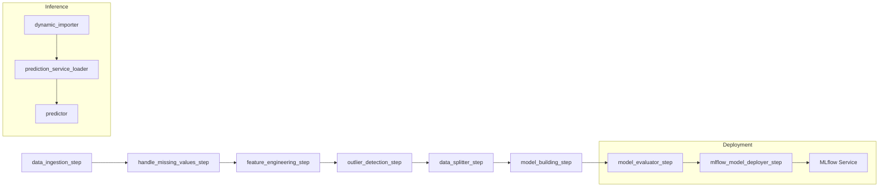

h1. Prices Predictor System Documentation

{toc}

h2. Overview
This documentation covers the end-to-end **Prices Predictor System**, a regression-based housing price prediction solution.
It describes architecture, setup, pipelines, steps, utilities, exploratory analysis, testing, and contribution guidelines.

h2. Architecture & Pipeline Flow

h3. System Diagram
|| Component || Description ||
\| ZenML Orchestrator | Coordinates pipeline steps |
\| MLflow | Tracks experiments and serves models |
\| Steps & Utilities | Modular code units for data processing |

{panel\:title=Mermaid Diagram|borderStyle=solid|borderColor=#ccc|titleBGColor=#F7F7F7}

{panel}

h2. Setup & Installation

h3. Prerequisites

* Python 3.8+
* (Optional) Docker for MLflow serving
* Virtual environment (venv / conda)

## h3. Clone & Install

{{code}}
git clone [https://github.com/your-org/prices-predictor-system.git](https://github.com/your-org/prices-predictor-system.git)
cd prices-predictor-system
pip install -r requirements.txt
{{code}}
--------

h3. Configuration
Edit `config.yaml` to adjust:

* `enable_cache` – toggle ZenML caching
* Docker integrations – required services
* Model metadata (name, license, description, tags)

h2. Pipelines

h3. Training Pipeline (`ml_pipeline`)

| Step                          | Input                   | Output                               | Description                          |
| ----------------------------- | ----------------------- | ------------------------------------ | ------------------------------------ |
| data\_ingestion\_step         | file\_path: str         | pd.DataFrame                         | Read housing data from ZIP           |
| handle\_missing\_values\_step | df, strategy\:str       | pd.DataFrame                         | Impute or drop missing               |
| feature\_engineering\_step    | df, strategy, features  | pd.DataFrame                         | Feature transforms                   |
| outlier\_detection\_step      | df, column\_name        | pd.DataFrame                         | Remove outliers (Z-score)            |
| data\_splitter\_step          | df, target\_column      | X\_train, X\_test, y\_train, y\_test | Train/test split                     |
| model\_building\_step         | X\_train, y\_train      | sklearn.Pipeline                     | ColumnTransformer + LinearRegression |
| model\_evaluator\_step        | model, X\_test, y\_test | dict, float                          | Compute metrics (MSE, R2)            |

h3. Deployment Pipeline (`continuous_deployment_pipeline`)

| Step                          | Signature                          | Description              |
| ----------------------------- | ---------------------------------- | ------------------------ |
| ml\_pipeline                  | () -> Pipeline                     | Retrains model           |
| mlflow\_model\_deployer\_step | (model, deploy\_decision, workers) | Deploy to MLflow service |

h3. Inference Pipeline (`inference_pipeline`)

| Step                        | Signature                                                  | Description                |
| --------------------------- | ---------------------------------------------------------- | -------------------------- |
| dynamic\_importer           | () -> Any                                                  | Load new batch data        |
| prediction\_service\_loader | (pipeline\_name, step\_name, running) -> PredictionService | Connect to MLflow service  |
| predictor                   | (service, input\_data) -> np.ndarray                       | Send data, get predictions |

h2. Code Overview

h3. Entry‐Point Scripts

* `run_pipeline.py` – Launch training pipeline
* `run_deployment.py` – Trigger retrain & deploy, or stop service
* `sample_predict.py` – Client for single-record inference

h3. Core Utilities (`src/`)

| Module                     | Responsibility                 |
| -------------------------- | ------------------------------ |
| ingest\_data.py            | DataIngestorFactory & readers  |
| handle\_missing\_values.py | MissingValueHandler strategies |
| feature\_engineering.py    | Transformers & encoders        |
| outlier\_detection.py      | Z-score outlier detector       |
| data\_splitter.py          | TrainTestSplit strategy        |
| model\_building.py         | Sklearn pipeline constructor   |
| model\_evaluator.py        | Regression evaluation metrics  |
| model\_loader.py           | MLflow model loader            |

h2. Exploratory Data Analysis (EDA)
The `analysis/` folder stores Jupyter scripts and notebooks for data exploration:

* basic\_data\_inspection.py – Data summary & null analysis
* missing\_values\_analysis.py – Missing patterns
* univariate\_analysis.py – Individual distributions
* bivariate\_analysis.py – Feature vs target plots
* multivariate\_analysis.py – Correlation & PCA diagnostics
* EDA.ipynb – Combined notebook with narrative and visualizations

h2. Testing
*No automated tests included.*
**Recommended:**

# Add pytest tests under `tests/`

# Cover each step function and utility

# Run with:

---

{{code}}
pytest
{{code}}
--------

h2. Contributing

# Fork the repo

# Create a branch: `feature/your-feature`

# Commit & push changes

# Open a Pull Request

h2. References

* ZenML Documentation: [https://docs.zenml.io](https://docs.zenml.io)
* MLflow Documentation: [https://mlflow.org/docs](https://mlflow.org/docs)
* Kaggle House Prices Dataset: [https://www.kaggle.com/c/house-prices-advanced-regression-techniques/data](https://www.kaggle.com/c/house-prices-advanced-regression-techniques/data)

h2. License
Apache 2.0 — See [LICENSE](./LICENSE) for details.
